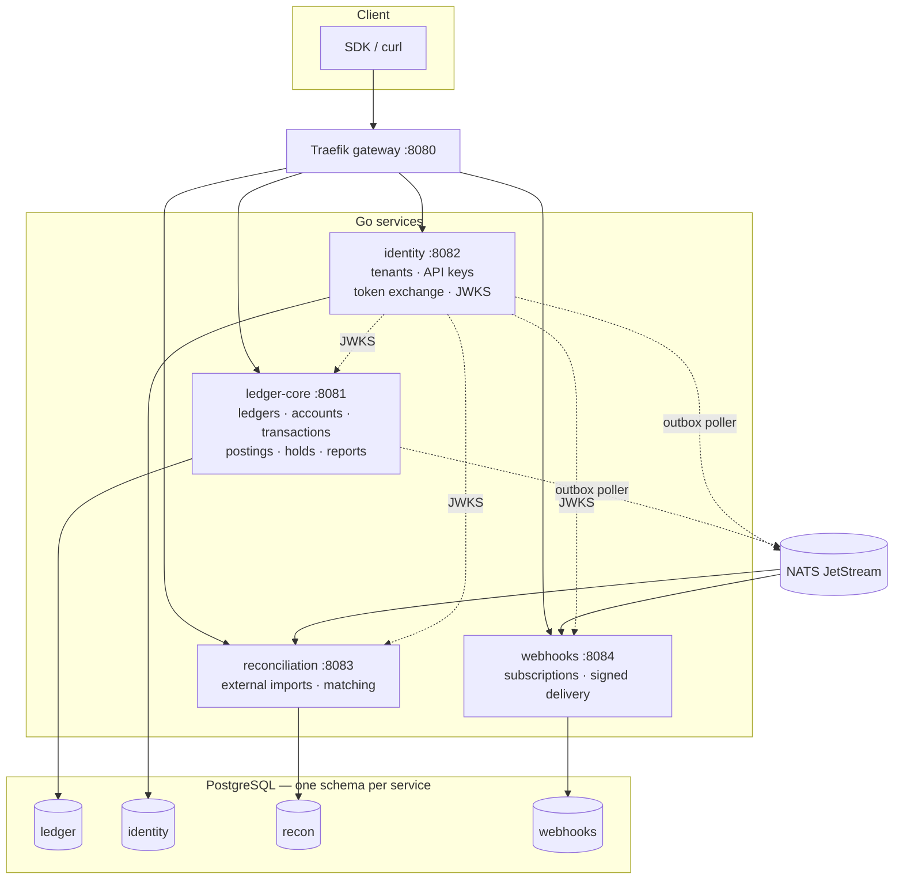
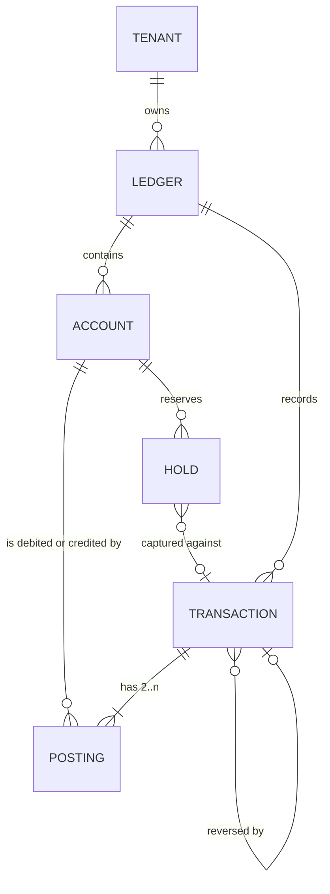
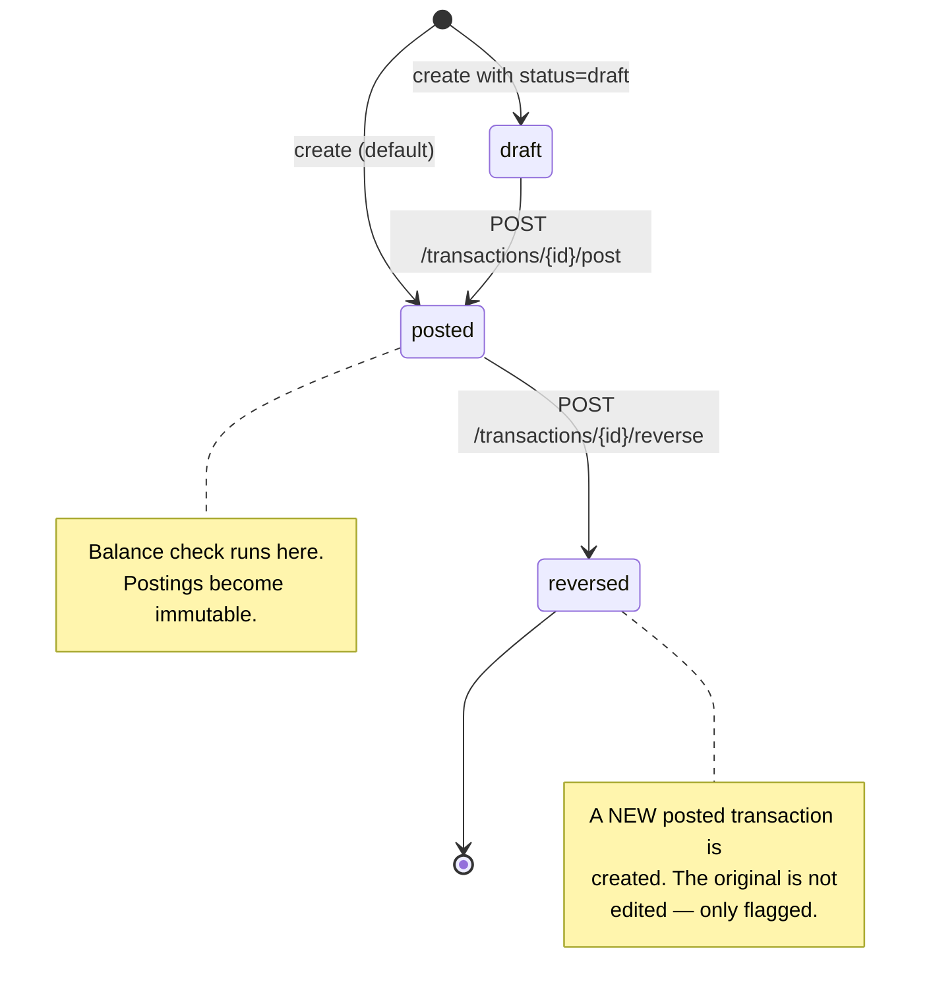
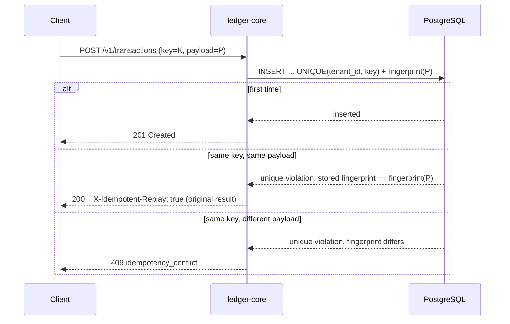
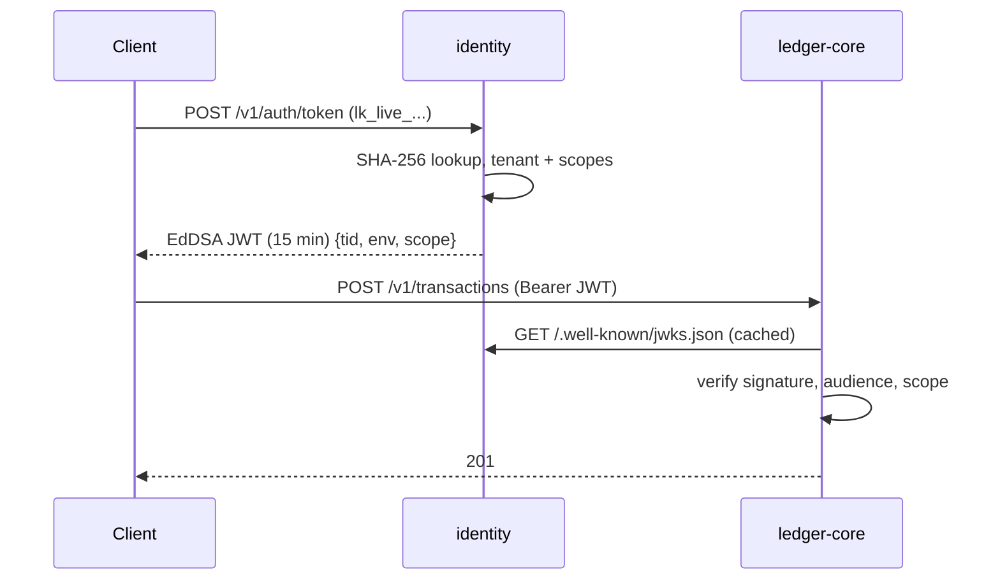
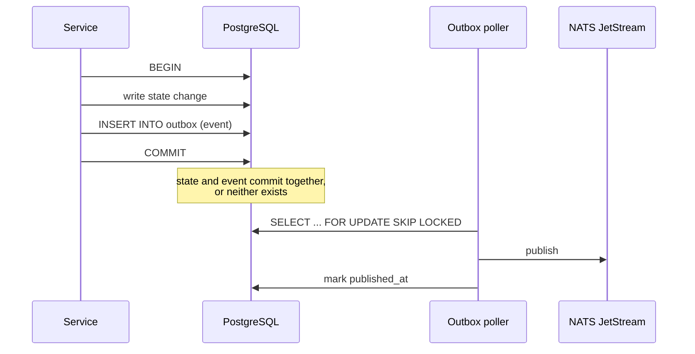

# Architecture

Four Go services over one PostgreSQL instance, with NATS JetStream carrying
events published through a transactional outbox. Every design choice below has
an ADR in [`adr/`](adr/); this document is the map, the ADRs are the reasoning.

## Boundaries



Two rules hold this together, and breaking either is what turns a set of
services back into a distributed monolith:

1. **A service reads only its own schema.** There is no cross-schema query
   anywhere. If `reconciliation` needs to know a transaction was posted, it
   learns it from an event, not from `ledger.transactions`.
2. **A service never calls another service on the write path.** The only
   synchronous cross-service dependency is fetching identity's public JWKS,
   which is cached and does not touch a database.

## Domain model



| Entity | Notes |
|---|---|
| **Ledger** | A book of accounts. A tenant may have many; they do not interact. |
| **Account** | A path-like name (`assets:cash`), a type (`asset`, `liability`, `equity`, `revenue`, `expense`) and a normal balance (`DEBIT` or `CREDIT`). Types are fixed; the naming convention is yours. |
| **Transaction** | `draft` → `posted` → `reversed`. Only firm transactions are checked for balance. |
| **Posting** | Immutable. One account, one direction, one asset, a strictly positive `BIGINT` amount. |
| **Hold** | A reservation against an account's available balance. Not an accounting entry. |

Identifiers are UUIDv7: time-ordered, so they index well, without exposing a
sequential count of your business.

## The posting model

A transaction carries two or more postings. Each is a single-sided movement:

```
DEBIT   assets:cash                 USD 10000
CREDIT  liabilities:customer:wallet USD  9700
CREDIT  revenue:fees                USD   300
```

There is no "from/to" field, deliberately. A transfer with a fee is not two
accounts, it is three — and a model that forces every movement into a pair
either loses the fee or invents a second transaction that can drift from the
first. The constraint is the accounting one: per asset, debits equal credits.

Amounts are integers in minor units, with the exponent living in the tenant's
asset registry rather than on each row. Over the API they travel as strings, so
a JavaScript client cannot silently lose precision past 2^53.

### Lifecycle



A `draft` is a workspace: it can be assembled over several requests and is not
balance-checked until it becomes firm. Once `posted`, the postings can never
change. A correction is always a new compensating transaction.

## Balances

Four numbers, reported separately because they answer different questions:

| Field | Meaning |
|---|---|
| `posted` | The sum of posted postings. The accounting truth. |
| `held` | Sum of active holds. Money reserved but not moved. |
| `available` | `posted` minus `held`. What a new hold or debit can draw on. |
| `pending` | Movement from transactions that are not yet firm. |

`posted_debits` and `posted_credits` are also returned, so a net of zero can be
distinguished from no activity at all — which is what makes a reversal legible
in the balance rather than invisible.

`account_balances` is a materialised projection updated in the **same database
transaction** as the postings that move it. There is no eventual-consistency
window and no reconciliation job to catch up. A verifier
(`ledger.verify_account_balances`) recomputes it from the postings on demand and
reports drift; `TestVerifyBalancesDetectsDrift` proves it detects it.

## Holds

A hold is a **reservation layer**, and the semantics are worth stating plainly
because ambiguity here is where systems lose money:

- Creating a hold lowers `available`. It does **not** create postings and does
  not change `posted`.
- A hold larger than `available` is rejected with `insufficient_funds`.
- **Capture does not move money.** You post the transaction yourself and pass
  its id to the capture call, which links the two and frees the reservation. A
  partial capture releases the remainder.
- Capturing or releasing a hold twice is a `conflict`.
- Holds carry an expiry.

The consequence: holds do not appear in the trial balance, because nothing has
been posted. If you need reserved funds to show up in your accounts, model them
as a posting to a dedicated liability account and use the hold only for the
availability check.

## Idempotency

Every mutation requires a key, either as `Idempotency-Key` or in the body.



The uniqueness is a database constraint, not a `SELECT` followed by an
`INSERT` — so two identical requests racing each other cannot both find "no
existing row" and both write. The fingerprint covers the fields that change the
meaning of the request and ignores the ones that do not, which is what
`TestIdempotencyFingerprintSemanticFields` pins down.

## Authentication



API key secrets are stored only as hashes and shown once. The token is short
enough that revocation takes effect without a per-request lookup, and the other
services never read identity's tables — they verify a signature against a cached
public key. Signing keys are encrypted at rest with a master key from the
environment; rotation means publishing a new `kid` in the JWKS.

For local development, `LEDGERCORE_AUTH_DISABLED=true` takes the tenant from an
`X-Tenant-Id` header. The hardened compose overlay refuses to start with it.

## Events and the outbox

Publishing an event after a commit loses it whenever the process dies in
between. So nothing publishes directly:



`SKIP LOCKED` lets several poller instances run without coordinating. Delivery
is **at-least-once**: a crash between publishing and marking republishes the
event. Every consumer is therefore idempotent, using deterministic ids and
`ON CONFLICT DO NOTHING`. Event schemas are JSON Schema documents in
[`../contracts/events/`](../contracts/events/).

## Multi-tenancy

Pooled multi-tenancy: one database, one set of tables, `tenant_id` on every
business row, and Row-Level Security doing the filtering.

```sql
CREATE POLICY tenant_isolation ON postings
  USING      (tenant_id = current_setting('app.tenant_id')::uuid)
  WITH CHECK (tenant_id = current_setting('app.tenant_id')::uuid);
ALTER TABLE postings FORCE ROW LEVEL SECURITY;
```

`FORCE` matters: without it the policy does not apply to the table's owner.
`WITH CHECK` matters: without it a tenant could *write* a row belonging to
another and simply not see it afterwards.

Every access goes through `pgxutil.WithTenantTx`, which opens a transaction and
issues `SET LOCAL app.tenant_id`. A query that skips it sees nothing, which
fails loudly rather than leaking.

Four database roles, one per service, all `NOSUPERUSER NOBYPASSRLS`, each with
privileges on its own schema only. A fifth role owns migrations; a sixth
(`ledgercore_maint`, no login) owns the `SECURITY DEFINER` maintenance
functions, so a compromised service cannot call itself into a purge. The full
model is in [`postgres-role-model.md`](postgres-role-model.md).

## Concurrency

See [`concurrency.md`](concurrency.md).

## Persistence and migrations

Goose migrations, embedded in each service's binary, numbered and never edited
after merge. They run as the migrator role — the runtime roles hold no DDL
privilege at all, so a compromised service cannot alter a table or drop a
trigger. In compose, a one-shot `migrate` container runs them and exits before
the services start.

## Observability

Structured JSON logs via `log/slog`, a request id on every response and every
error body, and a `/healthz` per service. OpenTelemetry is wired through the
standard `OTEL_*` environment variables and is a **no-op when they are unset** —
which is the honest description of its current state: the plumbing exists, the
instrumentation is thin.

## What is not here

- No KMS. The master key is an environment variable.
- No global rate limiting. The gateway can do per-IP limiting; nothing in the
  services enforces a quota.
- No high availability. One PostgreSQL, one of each service, no failover story.
- No FX engine, no settlement, no payment-provider connectivity.
